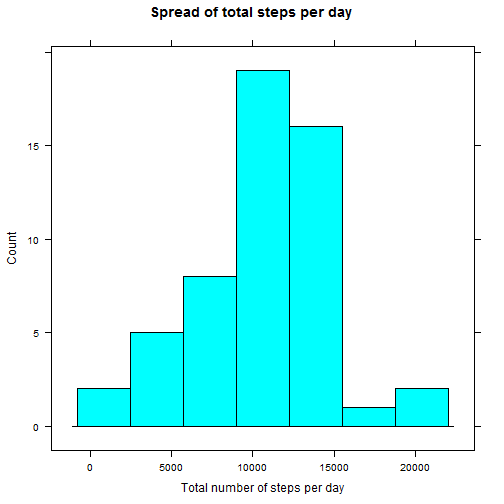
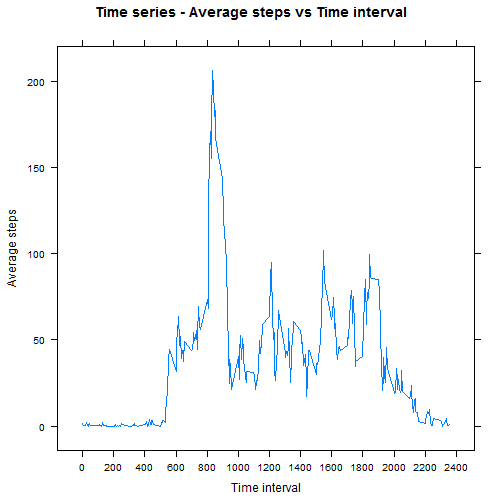
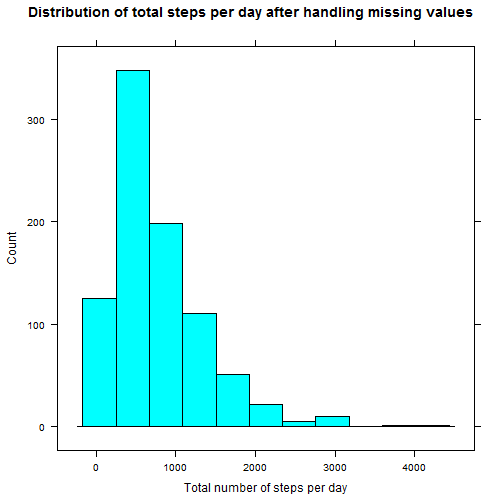
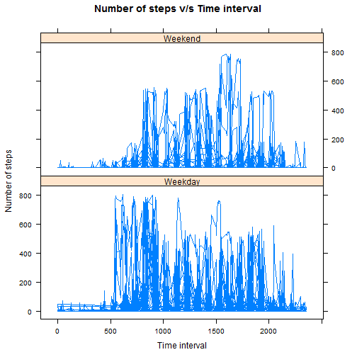

## Loading and preprocessing the data


```r
library(knitr)
library(lattice)
library(xtable)

opts_chunk$set(eval = TRUE)

if (!file.exists("RRA1")) {dir.create("RRA1")}

fileUrl <- "http://d396qusza40orc.cloudfront.net/repdata%2Fdata%2Factivity.zip"
destfile <- "./RRA1/activity_data.zip"

setInternet2(use = TRUE)
download.file(fileUrl, destfile = destfile, mode="wb")
dateDownloaded <- date()
unzip(destfile)
```


## What is mean total number of steps taken per day?


```r
actdata <- read.csv( "activity.csv")

steps <- actdata$steps
date <- actdata$date
interval <- actdata$interval

complete <- !is.na(steps)
complete_steps <- steps[complete]
complete_date <- date[complete]

date_factor <- factor(complete_date)

total_steps <- tapply(complete_steps, date_factor, FUN = sum)

histogram(total_steps, 
          xlab = "Total number of steps per day", 
          main = "Spread of total steps per day", 
          type = "count")
```

 

The mean is:

```r
mean_original <- mean(total_steps)
mean_original
```

```
## [1] 10766.19
```

The median is:

```r
median_original <- median(total_steps)
median_original
```

```
## [1] 10765
```


## What is the average daily activity pattern?


```r
interval_factor <- factor(interval)
levels <- nlevels(interval_factor)
interval_factor <- factor(interval)[1:levels]

average_steps <- tapply(steps, factor(interval), FUN = mean, na.rm = TRUE)
average_steps <- sapply(average_steps, simplify = array, round, 2)

scales=list( x=list(at = seq(0, 2400, 200)))

xyplot(as.numeric(average_steps) ~ interval[1:288], 
       type = "l", 
       xlab = "Time interval",
       ylab = "Average steps", 
       main = "Time series - Average steps vs Time interval", 
       scales = scales)
```

 

Also to find the 5 minute interval, on average across all the days in the dataset, contains the maximum number of steps


```r
df_interval_steps <- data.frame(interval_factor, average_steps)
df_interval_steps <- df_interval_steps[order(df_interval_steps$average_steps, decreasing = TRUE),]
max_time_interval <- df_interval_steps$interval_factor[1]
max_time_interval <- as.numeric(as.character(max_time_interval))
```


```r
max_time_interval
```

```
## [1] 835
```

## Imputing missing values


```r
length(steps[is.na(steps)])
```

```
## [1] 2304
```

```r
new_steps <- steps
for (i in which(sapply(new_steps, is.na))) {
  if (i <= 288){
    new_steps[i] <- average_steps[i]
  } 
  else{
    j <- i%%288 + 1
    new_steps[i] <- average_steps[j]
  }
}

new_days_factor <- factor(new_steps)

new_total_steps <- tapply(new_steps, new_days_factor, FUN = sum)

histogram(new_total_steps, 
          xlab = "Total number of steps per day", 
          main = "Distribution of total steps per day after handling missing values", 
          type = "count")
```

 

The mean calculated is:


```r
mean_new <- mean(new_total_steps)
mean_new
```

```
## [1] 755.7388
```

The median is:


```r
median_new <- median(new_total_steps)
median_new
```

```
## [1] 612
```

Now we compare to the original:


```r
original <- c(mean_original, median_original)
new_one <- c(mean_new, median_new)
table <- data.frame(original, new_one)
result <- apply(table, 1, function(x) (x[2])/(x[1]/100))
table$compare <- result
rownames(table)<-c("mean", "median")
print(xtable(table), type="html")
```

```
## <!-- html table generated in R 3.1.2 by xtable 1.7-4 package -->
## <!-- Sun Feb 15 19:00:46 2015 -->
## <table border=1>
## <tr> <th>  </th> <th> original </th> <th> new_one </th> <th> compare </th>  </tr>
##   <tr> <td align="right"> mean </td> <td align="right"> 10766.19 </td> <td align="right"> 755.74 </td> <td align="right"> 7.02 </td> </tr>
##   <tr> <td align="right"> median </td> <td align="right"> 10765.00 </td> <td align="right"> 612.00 </td> <td align="right"> 5.69 </td> </tr>
##    </table>
```

The impact of missing data is therefore seen to indroduce huge deviation by changing the dataset.


## Are there differences in activity patterns between weekdays and weekends?


```r
date_new <- as.Date(date)
whichDay <- weekdays(date_new)
weekendDays <- c("Saturday", "Sunday")

days_DF <- data.frame(date_new, interval_factor, new_steps, whichDay)

isWeekend <- days_DF$whichDay %in% weekendDays
days_DF$dayType = factor(isWeekend,labels = c("Weekday","Weekend"))

xyplot(days_DF$new_steps ~ interval | days_DF$dayType, layout = c(1, 2), type = "l", 
       xlab = "Time interval", ylab = "Number of steps", main = "Number of steps v/s Time interval" )
```

 

